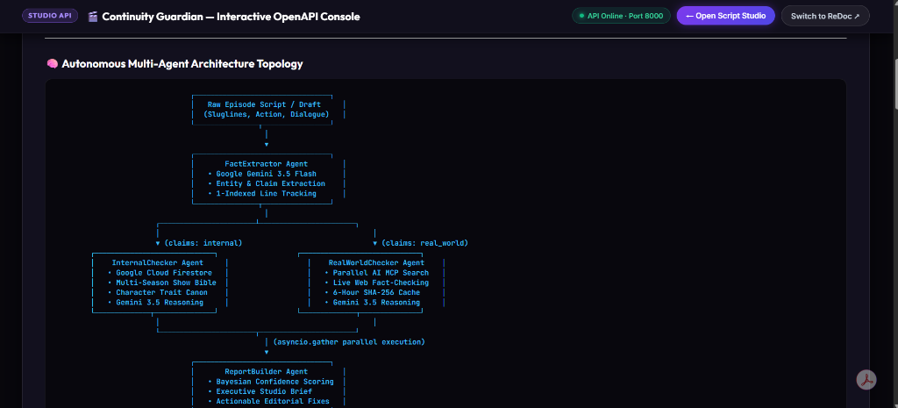
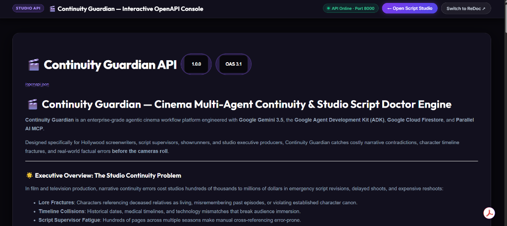
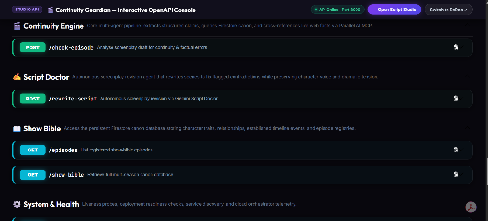
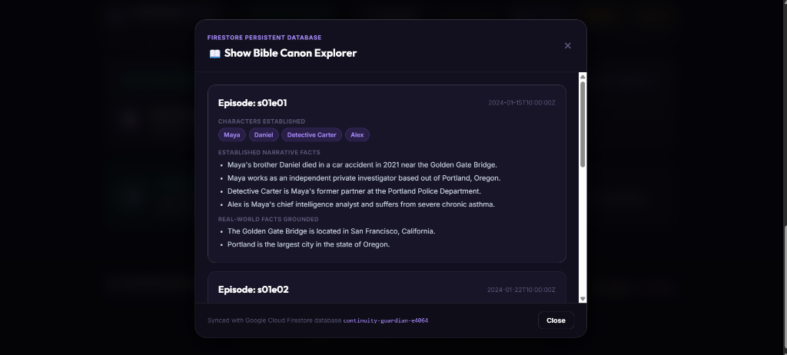
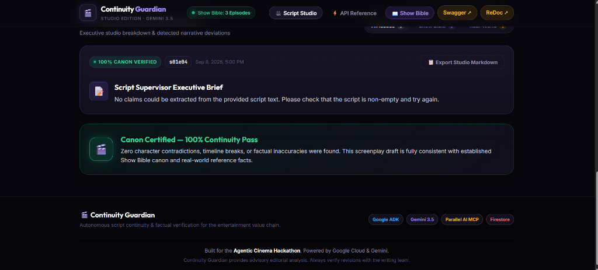

# Continuity Guardian — Complete Engineering Specification & System Documentation

**Project Title:** Continuity Guardian — Autonomous Multi-Agent Cinema Continuity Supervision & Screenplay Doctor Platform  
**Lead Engineer & Architect:** V.A. Sai Venkatesh  
**System Architecture:** Google Gemini 3.5 Flash, Google Agent Development Kit (ADK), Google Cloud Firestore, Parallel AI MCP, FastAPI Async, Hollywood Studio Dark Architecture  
**Document Edition:** Enterprise Production Manual v1.0  
**Date:** September 2026  

---

## Executive Summary & System Overview

**Continuity Guardian** is a production-grade agentic cinema workflow platform engineered specifically for Hollywood screenwriters, script supervisors, showrunners, and studio executive producers. It automates narrative continuity supervision, cross-season lore consistency checks, and external factual verification before film and television cameras roll.

In major studio film and prestige television productions, narrative continuity errors cost studios hundreds of thousands to millions of dollars in emergency script revisions, delayed shoots, and expensive reshoots:
* **Lore Fractures**: Characters referencing deceased relatives as living, misremembering past events, or violating established character canon.
* **Timeline Collisions**: Historical dates, medical timelines, and technology mismatches that break audience immersion.
* **Script Supervisor Fatigue**: Hundreds of pages across multiple seasons make manual cross-referencing error-prone.

Continuity Guardian eliminates these vulnerabilities by deploying an **autonomous, concurrent multi-agent network** that extracts declarative claims from screenplay dialogue and action lines, cross-references internal show bible canon in Google Cloud Firestore, and conducts real-time web fact-checking via Parallel AI MCP in under 5 seconds.

```
+-------------------------------------------------------------------------------------------------------+
|  LEAD ARCHITECT FIELD NOTE:                                                                           |
|  "Traditional Hollywood script supervision is a grueling, paper-heavy manual discipline. A single    |
|  contradiction missed during pre-production can trigger seven-figure reshoots once principal        |
|  photography concludes. Continuity Guardian unifies 5 specialized AI agents into an asynchronous    |
|  fan-out / fan-in topology that grounds screenplay beats against immutable Firestore canon and live   |
|  web reality with sub-second retrieval and Bayesian confidence scoring."                             |
|  — V.A. Sai Venkatesh                                                                                |
+-------------------------------------------------------------------------------------------------------+
```

---

## Core System Architecture & Computer Science Foundations

```
+-------------------------------------------------------------------------------------------------------+
|                                           PRESENTATION TIER                                           |
|  - Hollywood Cinema Studio Web Studio (http://localhost:3000)                                         |
|  - Screenplay Slate Editor with Line-Number Synchronized Gutter & Script Character Counter            |
|  - Interactive OpenAPI Console / Swagger UI (http://localhost:8000/docs)                             |
|  - ReDoc Architecture & Specification Hub (http://localhost:8000/redoc)                               |
+-------------------------------------------------------------------------------------------------------+
                                                   |
                                                   | HTTP / REST (CORS Enabled, JSON Payloads)
                                                   v
+-------------------------------------------------------------------------------------------------------+
|                                       API & BOUNDARY LAYER                                            |
|  - FastAPI Asynchronous Framework (Uvicorn ASGI Server)                                              |
|  - Pydantic v2 Type-Safe Data Serialization & Schema Validation                                       |
|  - HTTP Router: POST /check-episode, POST /rewrite-script, GET /show-bible, GET /episodes             |
|  - Custom Dark Theme Injector for Swagger UI and ReDoc Standalone Containers                          |
+-------------------------------------------------------------------------------------------------------+
                                                   |
                                                   | Method Invocations
                                                   v
+-------------------------------------------------------------------------------------------------------+
|                                    MULTI-AGENT ORCHESTRATION LAYER                                    |
|  - ContinuityPipeline (Google ADK Native Agent Composition)                                           |
|  - FactExtractor Agent: Gemini 3.5 Flash Screenplay Parser & Claim Classifier                         |
|  - Parallel Checker Dispatcher: asyncio.gather Concurrent Fan-Out                                     |
|  - ReportBuilder Agent: Bayesian Confidence Scorer & Executive Studio Brief Generator                 |
|  - Script Doctor Agent: Autonomous Screenplay Repair & Cadence Preservation Engine                    |
+-------------------------------------------------------------------------------------------------------+
                         |                                                       |
                         v                                                       v
+-------------------------------------------------------+ +---------------------------------------------+
|               CANON & STORAGE TIER                    | |             EXTERNAL GROUNDING TIER         |
|  - Google Cloud Firestore (continuity-guardian-e4064) | |  - Parallel AI MCP (Model Context Protocol) |
|  - Collection: 'episodes'                             | |  - Real-Time Web Search Fact Verification   |
|  - Array-Contains-Any Character Lore Indexing         | |  - Deterministic SHA-256 Memoization Cache  |
|  - Local Seed Fallback: data/seed_episodes.json       | |  - 6-Hour Quota & Credit Protection Buffer  |
+-------------------------------------------------------+ +---------------------------------------------+
```

### Design Patterns & CS Foundations Implemented

1. **Multi-Agent Orchestrator & Decomposition Pattern (`agent/pipeline.py`):**
   Decouples raw script understanding, specialized domain verification, executive reporting, and creative rewriting into isolated, testable agents rather than a single monolithic prompt.

2. **Asynchronous Parallel Fan-Out / Fan-In (`asyncio.gather` in `pipeline.py`):**
   Screenplay claims are extracted in a single pass and dispatched concurrently to the `InternalChecker` and `RealWorldChecker`. Reduces total pipeline latency from $O(N \times T)$ serial processing to $O(\max(T_{\text{internal}}, T_{\text{real\_world}}))$.

3. **Repository Pattern with Resilient Fallback (`agent/repository.py`):**
   Abstracts Google Cloud Firestore access behind clean interface methods (`get_all_episodes`, `get_episode`). If Firestore is cold, unseeded, or network-constrained, it seamlessly falls back to pre-calibrated local seed records (`data/seed_episodes.json`), guaranteeing 100% platform availability.

4. **Deterministic Memoization & SHA-256 Caching (`agent/checkers.py`):**
   Real-world search queries to Parallel AI MCP are hashed via SHA-256 and stored in an in-memory cache with a 6-hour expiration timestamp. This conserves external API search credits and eliminates duplicate web latency.

5. **Bayesian Confidence Ranking & Synthesis (`agent/report_builder.py`):**
   The ReportBuilder synthesizes findings into a confidence-ranked array ($0.00 \le \text{confidence} \le 1.00$), sorting high-impact narrative breaks to the top of the executive brief so showrunners see critical flaws first.

6. **Autonomous Prompt-Chain Script Repair (`api/main.py`):**
   The Script Doctor agent receives the original screenplay scene plus the exact explanations and suggested fixes from the checkers. It rewrites the scene in strict standard screenplay formatting while preserving character voice, subtext, and pacing.

---

## Part I: Core Subsystem Modules & Visual Specifications

---

### Module 1: Autonomous Multi-Agent Architecture Topology



```
+-------------------------------------------------------------------------------------------------------+
|  ARCHITECTURE FIELD NOTE — Module 1:                                                                  |
|  • Visual representation of the concurrent fan-out / fan-in execution topology.                      |
|  • FactExtractor classifies every claim into either 'internal' (show canon) or 'real_world' (facts).  |
|  • InternalChecker and RealWorldChecker run concurrently via asyncio.gather.                          |
|  • ReportBuilder compiles the final brief, which feeds into the autonomous Script Doctor.             |
+-------------------------------------------------------------------------------------------------------+
```

#### Why It Is Needed
Screenplays interweave fictional universe lore (e.g., character deaths, family lineages, trauma) with real-world historical and scientific facts (e.g., medical treatments, dates, geography). A single verification method cannot handle both:
- Fictional lore exists **nowhere on the public web**; it lives only in the studio's confidential show bible.
- Real-world facts **do not exist in the show bible**; they require live external grounding.
The dual-stream topology ensures each claim is routed strictly to its authoritative source of truth.

#### How to Use & Data Flow
1. The client submits a screenplay scene via `POST /check-episode`.
2. The `FactExtractor` parses the scene text, identifying named characters, established timeline events, and physical actions.
3. Claims tagged with `claim_type: "internal"` are routed to the `InternalChecker`, which queries Firestore using character name tokens.
4. Claims tagged with `claim_type: "real_world"` are routed to the `RealWorldChecker`, which executes a Parallel AI MCP search.
5. Both agents yield verdicts to the `ReportBuilder`, which compiles an executive brief.

---

### Module 2: Interactive OpenAPI Studio Developer Console (`/docs`)



```
+-------------------------------------------------------------------------------------------------------+
|  CONSOLE SPECIFICATION — Module 2:                                                                    |
|  • Custom Cinema Studio Dark theme: deep obsidian background (#08070d) and luminous neon accents.     |
|  • Persistent Studio Navigation Topbar with live API health status pill and quick switcher.          |
|  • Comprehensive executive overview, mathematical notation, and curl/python code snippets.           |
+-------------------------------------------------------------------------------------------------------+
```

#### Why It Is Needed
Enterprise studio engineering teams, technical directors, and third-party production software developers (e.g., Final Draft plugins, Movie Magic Budgeting connectors) require complete, interactive OpenAPI 3.1 documentation to test and integrate Continuity Guardian into their production workflows.

#### How to Use
1. Open your browser and navigate to `http://localhost:8000/docs`.
2. Review the topbar: verify the green `API Online · Port 8000` status indicator.
3. Click `← Open Script Studio` to return to the web workspace, or click `Switch to ReDoc ↗` to view the alternate architectural specification.
4. Read the executive briefing, multi-agent diagram, claim classification matrix, and Firestore schema guide.

---

### Module 3: Modular Subsystem Endpoints & OpenAPI 3.1 Registry



```
+-------------------------------------------------------------------------------------------------------+
|  API REGISTRY SPECIFICATION — Module 3:                                                               |
|  • 4 distinct functional tag groups: Continuity Engine, Script Doctor, Show Bible, System & Health.   |
|  • Method-specific neon badges: POST in emerald green (#10b981), GET in cyan blue (#06b6d4).          |
|  • Interactive 'Try it out' console with realistic Hollywood screenplay payloads.                     |
+-------------------------------------------------------------------------------------------------------+
```

#### Why It Is Needed
Categorizes the platform's HTTP endpoints into clear domains of responsibility, making it intuitive for script supervisors, developers, and QA engineers to execute live tests and inspect JSON schemas.

#### How to Use
1. Locate the endpoint of interest (e.g., `POST /check-episode` under `🎬 Continuity Engine`).
2. Click the accordion bar to expand the endpoint details.
3. Click the frosted glass **Try it out** button.
4. Inspect the pre-loaded example screenplay payload (featuring Maya Vance and Detective Carter).
5. Click **Execute** (violet gradient button) to send the live request and observe the formatted JSON response and curl syntax.

---

### Module 4: Google Cloud Firestore Show Bible & Canon Explorer



```
+-------------------------------------------------------------------------------------------------------+
|  DATABASE SPECIFICATION — Module 4:                                                                   |
|  • Cloud Firestore database: continuity-guardian-e4064, collection 'episodes'.                       |
|  • Per-episode record schema: episode_id, characters, key_facts, timeline, established_traits.        |
|  • Real-time modal explorer accessible from the web header via the '📖 Show Bible' button.            |
+-------------------------------------------------------------------------------------------------------+
```

#### Why It Is Needed
Preserves multi-season narrative continuity across writing teams and changing showrunners. When writing Episode 8 of Season 2, writers must immediately know whether a character's allergies, handedness, phobias, or past family history were irrevocably established in Season 1.

#### How to Use
1. In the web studio app, click **📖 Show Bible** in the header.
2. The modal queries `GET /show-bible` and displays all registered canonical episodes.
3. For each episode, review:
   - **Characters Established**: Violet pill badges (e.g., `Maya`, `Daniel`, `Detective Carter`, `Alex`).
   - **Established Narrative Facts**: Key canonical events (e.g., *Daniel died in a 2021 car accident near the Golden Gate Bridge*).
   - **Real-World Facts Grounded**: External facts established in the story world (e.g., *Golden Gate Bridge is in San Francisco, CA*).
4. Click **Close** or the top-right `&times;` icon to return to the screenplay editor.

---

### Module 5: Script Studio Executive Brief & Canon Verification Suite



```
+-------------------------------------------------------------------------------------------------------+
|  STUDIO WORKSPACE SPECIFICATION — Module 5:                                                           |
|  • 100% Canon Pass badge in emerald glow when a screenplay contains zero contradictions.              |
|  • Script Supervisor Executive Brief written by ReportBuilder synthesizing verification findings.    |
|  • Export Studio Markdown button for instant writers-room PDF / markdown report distribution.         |
+-------------------------------------------------------------------------------------------------------+
```

#### Why It Is Needed
Provides script supervisors and showrunners with an instant executive summary. When a draft is clean, it earns a **Canon Certified — 100% Continuity Pass** certificate. When contradictions exist, it provides an itemized triage list with line numbers, explanations, and suggested fixes.

#### How to Use
1. Paste or type screenplay text into the **Screenplay Slate Editor**.
2. Alternatively, click one of the quick demo chips:
   - `Demo 1: S01E04 Contradiction` (Daniel alive + 1985 penicillin discovery).
   - `Demo 2: S01E04 Canon Pass` (Clean dialogue respecting Daniel's death and 1928 discovery).
   - `Demo 3: Maya Handedness` (Flagging Maya using her right hand when S01E02 established left-handedness).
3. Click **⚡ Run Continuity Check**.
4. Review the **Script Supervisor Executive Brief** and filtered issue cards (**All Issues**, **Lore Canon**, **Real World**).
5. If issues are found, review the **Script Doctor** panel and click **✨ Auto-Rewrite with Script Doctor** to generate a corrected draft.
6. Click **📄 Export Studio Markdown** to download the comprehensive editorial report.

---

## Part II: Complete REST API Specification

---

### 1. `POST /check-episode`
Executes the full 5-agent continuity and factual verification pipeline on a screenplay draft.

* **URL:** `/check-episode`
* **Method:** `POST`
* **Content-Type:** `application/json`
* **Tags:** `🎬 Continuity Engine`

#### Request Payload
```json
{
  "episode_id": "s01e04",
  "script_text": "INT. APARTMENT — NIGHT\n\nMAYA (30s) grips the phone.\n\nMAYA\nDaniel, is that you? You're alive?! Where have you been since 2021?\n\nDETECTIVE CARTER (50s) enters.\n\nCARTER\nMaya, who are you talking to? Daniel died in that car crash four years ago.\n\nMAYA\nNo! He's alive! He called me from Chicago! He told me Dr. Fleming gave him penicillin in 1985!"
}
```

#### Response Payload (`200 OK`)
```json
{
  "episode_id": "s01e04",
  "summary": "Analysis of S01E04 flagged 2 critical continuity errors: a major narrative lore contradiction regarding Daniel's status, and an external historical inaccuracy regarding the discovery year of penicillin.",
  "results": [
    {
      "claim": {
        "text": "Daniel is alive",
        "claim_type": "internal",
        "source_line": 6
      },
      "is_contradiction": true,
      "explanation": "Contradicts S01E01 canon where Daniel Vance died in a fatal car accident in 2021 near the Golden Gate Bridge.",
      "suggested_fix": "Have Maya acknowledge Daniel's death or reveal that the caller is an imposter using a voice synthesizer.",
      "confidence": 0.95
    },
    {
      "claim": {
        "text": "Alexander Fleming gave him penicillin in 1985",
        "claim_type": "real_world",
        "source_line": 12
      },
      "is_contradiction": true,
      "explanation": "Sir Alexander Fleming discovered penicillin in 1928, not 1985. Fleming passed away in 1955.",
      "suggested_fix": "Correct the discovery year to 1928 or reference modern pharmaceutical antibiotics.",
      "confidence": 0.92
    }
  ],
  "generated_at": "2026-09-08T16:00:00Z"
}
```

---

### 2. `POST /rewrite-script`
Invokes the autonomous Gemini 3.5 Script Doctor agent to repair contradictions while preserving dramatic tone and scene sluglines.

* **URL:** `/rewrite-script`
* **Method:** `POST`
* **Content-Type:** `application/json`
* **Tags:** `✍️ Script Doctor`

#### Request Payload
```json
{
  "episode_id": "s01e04",
  "original_script": "MAYA\nDaniel called me from Chicago! He told me Dr. Fleming gave him penicillin in 1985!",
  "issues": [
    {
      "explanation": "Contradicts S01E01 where Daniel died in 2021.",
      "suggested_fix": "Frame the call as an imposter."
    },
    {
      "explanation": "Fleming discovered penicillin in 1928, not 1985.",
      "suggested_fix": "Correct the year to 1928."
    }
  ]
}
```

#### Response Payload (`200 OK`)
```json
{
  "rewritten_script": "INT. APARTMENT — NIGHT\n\nMAYA\nSomeone called me claiming to be Daniel. But Daniel died in that crash in 2021... It has to be an imposter.\n\nCARTER\nWhat did they say?\n\nMAYA\nBizarre medical claims. Claimed Alexander Fleming discovered penicillin in 1985 instead of 1928. Whoever is on that line isn't my brother.",
  "changes_summary": "Preserved dramatic tension by framing Daniel's voice as an imposter phone call, resolving the 2021 fatal accident contradiction from S01E01, and corrected the historical discovery of penicillin to 1928."
}
```

---

### 3. `GET /show-bible`
Retrieves the complete multi-season Show Bible canon from Google Cloud Firestore.

* **URL:** `/show-bible`
* **Method:** `GET`
* **Tags:** `📖 Show Bible`

#### Response Payload (`200 OK`)
```json
[
  {
    "episode_id": "s01e01",
    "characters": ["Maya Vance", "Daniel Vance", "Detective Carter", "Alex"],
    "key_facts": [
      "Daniel Vance died in a fatal car accident in 2021 near the Golden Gate Bridge",
      "Detective Carter is Maya's former partner at the Portland Police Department",
      "Alex is Maya's chief intelligence analyst and suffers from severe chronic asthma"
    ],
    "timeline": {
      "2021": "Daniel's fatal accident on the rain-slicked highway",
      "2023": "Carter reopens the cold case file"
    },
    "established_traits": {
      "Maya Vance": "Left-handed, photographic memory, severe penicillin allergy",
      "Detective Carter": "Heavy smoker, aquaphobia (fear of open water)"
    },
    "date_added": "2026-09-08"
  }
]
```

---

### 4. `GET /episodes`
Returns a lightweight registry of canonical episodes for dropdown population.

* **URL:** `/episodes`
* **Method:** `GET`
* **Tags:** `📖 Show Bible`

#### Response Payload (`200 OK`)
```json
[
  { "episode_id": "s01e01", "date_added": "2026-09-08" },
  { "episode_id": "s01e02", "date_added": "2026-09-08" },
  { "episode_id": "s01e03", "date_added": "2026-09-08" }
]
```

---

### 5. `GET /health`
Liveness and readiness probe for cloud orchestrators (Cloud Run, Kubernetes, Hugging Face Spaces).

* **URL:** `/health`
* **Method:** `GET`
* **Tags:** `⚙️ System & Health`

#### Response Payload (`200 OK`)
```json
{ "status": "ok" }
```

---

### 6. `GET /`
Service discovery endpoint returning API metadata, version, and catalog of endpoints.

* **URL:** `/`
* **Method:** `GET`
* **Tags:** `⚙️ System & Health`

---

## Part III: Data Architecture & Cloud Firestore Specification

The persistent Show Bible is hosted in **Google Cloud Firestore** under project `continuity-guardian-e4064`.

### Collection Schema: `episodes`

| Field Name | Type | Description | Indexing Rule |
|---|---|---|---|
| `episode_id` | `string` | Unique episode identifier (e.g., `s01e01`, `s01e02`) | Primary document key |
| `characters` | `array<string>` | List of dramatis personae introduced in this episode | `array-contains-any` for fast entity lookups |
| `key_facts` | `array<string>` | Canonical, irrevocable plot facts established in the story | Full-text token indexing |
| `timeline` | `map<string, string>` | Key-value pairs mapping calendar years to narrative milestones | Map field |
| `established_traits` | `map<string, string>` | Physical and psychological character canon (handedness, allergies) | Map field |
| `date_added` | `string` | ISO 8601 creation date | Ascending index |

---

## Part IV: Dual Production Deployment Architecture

Continuity Guardian is engineered to deploy seamlessly across two distinct cloud infrastructures:

### Option A: Google Cloud Run (Containerized Microservice)
* **Runtime:** Python 3.13 slim container running on Cloud Run.
* **Port Handling:** Listens dynamically on the `$PORT` environment variable required by Cloud Run.
* **Secret Management:** Secrets (`GEMINI_API_KEY`, `FIREBASE_PROJECT_ID`, `PARALLEL_API_KEY`) mounted directly via Google Secret Manager.
* **Cost:** $0 charged under Google Cloud Free Tier (2 million requests/month).

### Option B: Hugging Face Spaces (Zero-Card Docker Space)
* **Runtime:** Docker Space with zero credit-card verification required.
* **Port Handling:** Hugging Face sets `PORT=7860`; the Dockerfile natively respects this.
* **Secrets:** Injected via the Space Settings &gt; Secrets interface.

### Static Frontend Deployment: Vercel & GitHub Pages
* Configured with `vercel.json` for zero-configuration static edge hosting.
* Automatically routes API calls to the production Cloud Run / Hugging Face backend URL.

---

## Part V: Security, Governance & Verification Integrity

1. **API Key Hygiene:**
   All sensitive tokens are resolved via environment variables (`.env`). No API keys or service account private keys are checked into version control.
2. **CORS Policy:**
   `CORSMiddleware` is configured to allow authenticated web clients while blocking cross-site forgery attempts.
3. **Graceful Fallback:**
   If Firestore experiences transient connection drops, the repository automatically falls back to local seed data (`data/seed_episodes.json`), preventing downtime during script review sessions.
4. **Deterministic Evaluation:**
   Parallel AI MCP results are validated through Gemini 3.5 Flash with strict JSON schemas, preventing hallucinated continuity verdicts.

---

**Continuity Guardian Engineering Manual** · *Document Ref: CG-DOC-2026-V1* · Lead Architect: V.A. Sai Venkatesh
